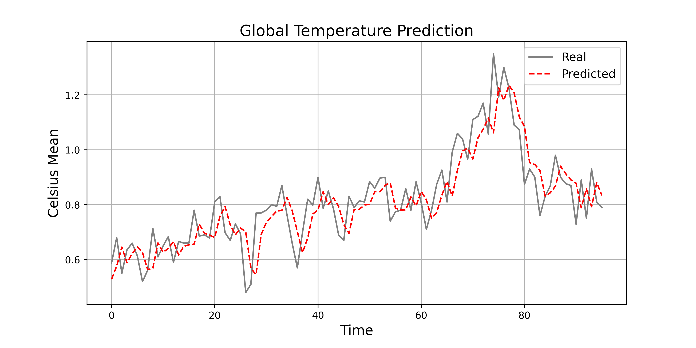

# Global Monthly Temperature Mean Predictor using LSTM Recurrent Neural Network (RNN)

**Authors:** Leo Martinez III - [LinkedIn](https://www.linkedin.com/in/leo-martinez-iii/)

**Contact:** [leo.martinez@students.tamuk.edu](mailto:leo.martinez@students.tamuk.edu)

**Created:** Summer 2024

---

This Python program implements a Long Short-Term Memory (LSTM) Recurrent Neural Network (RNN) for predicting global monthly temperature means. The dataset utilized for training and testing the model is the Global Temperature Time Series, available [here](https://datahub.io/core/global-temp?ref=hackernoon.com).

### Model Overview:

- **Language**: Python 3.18
- **IDE**: Spyder
- **Libraries Used**:
  - `numpy`
  - `pandas`
  - `matplotlib`
  - `sklearn`
  - `tensorflow`

### Implementation Details:

- **Data Loading**: The dataset is loaded and sorted by date.
- **Data Visualization**: The data is plotted to visualize the training and testing sets.
- **Data Scaling**: The data is scaled using MinMaxScaler to normalize the values.
- **Data Splitting**: The dataset is split into sequences of 250 steps for training the model.

### Model Architecture:

- **Input Layer**: Takes sequences of 250 time steps with 1 feature.
- **LSTM Layer**: Contains 125 units with 'tanh' activation.
- **Dropout Layer**: Randomly drops 15% of the data to prevent overfitting
- **Dense Layer**: Fully connected layer with 1 unit.

### Training:

The model is compiled with the RMSprop optimizer and mean squared error loss function. It is trained for 100 epochs with a batch size of 32.

### Evaluation:

The model's performance is evaluated on the test set, and predictions are made. The root mean squared error (RMSE) is calculated to measure the prediction accuracy.

### Visualization:

The plot of the global temperature prediction is saved as `Prediction_LSTM.png` with high DPI (400).

### Note:

- Program was created in Spyder and separators were utilized ('#%%') specifically for Spyder IDE
- A similar project using the same dataset, but instead using GRU can be found on my [GitHub Page](https://github.com/LeoMartinezTAMUK)
